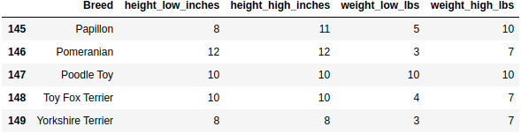
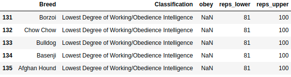
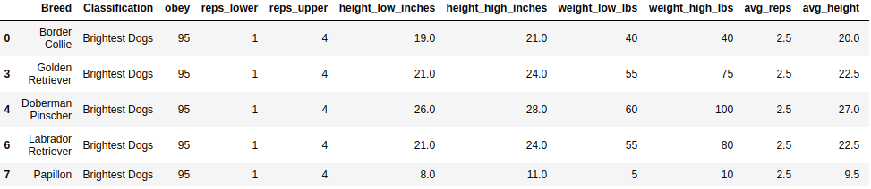
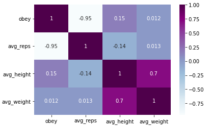

# Does size really matters for dog’s loyalty and intelligence?

You want to adopt a dog and you don’t have a big backyard or maybe even if you have, you want to keep your dogs at home with you and you want to adopt a smaller breed accordingly and you worry about loyalty and intelligence of your dog. Maybe you shouldn’t?

Dogs are one of the most loyal animals in the humans life. There are too many dog breeds to adopt. We prefer dog breeds based on the our needs as just a pet, police dog, drug dog, search and rescue dog, bandog, guard dog and so on. We can say that dog breeds are very diverse and this reflects their size, the job they can do, their loyalty and their intelligence as well. 

But are those really related to each others? Can we say that “Big dogs are more intelligent or loyal”

Let’s review this questions with data. We will try to answers the questions itemized below:

    • Is intelligence related to size?
    • Is loyalty related to size?
    • Is loyalty directly related to intelligence?

To find a answer to those questions firstly we need to meaningful data. It’s good to know there is data already provided for this purpose. You can see the data which is used to clarify those questions.

https://data.world/len/dog-size-intelligence-linked

You will find two different data set in the link.

Dog Breeds info which contains the **size of the dog** breeds:

And other data set contains **intelligence and obey** info for the dog breeds:

The table content of the **Figure 1** is obvious I think but for the table in the **Figure 2** we can talk about the obey and reps columns.

Dog loyalty and intelligence are measured by obey and reps. Obey refers to command count, how many command after dog executes the command. And reps stands for how many reps are needed by dog to learn/understand a new command. So we can associate these columns with intelligence (reps) and loyalty (obey). 

To analyse and process data with the mathematical operations we need to make sure all data types are proper, according to our purpose we should not have any missing data and after merge those two different data sets we can continue to analyse whole data.

If you check the data you will realize there are missing info for some breed which can be dropped and also for some breeds obey info is missing which can be imputed based on the reps information. After avoiding those data and merge the data sets we will have one data set and it looks like the table which is presented in the **Figure 3**.

Please note that in the merged table also we have some additional fields like averages of the other numeric fields to make mathematical processes easier.

After all data cleaning processing analysis we can evaluate the results:

**1. Is intelligence related to size?**

    It seems there is no directly relation between dog size and intelligence (avg_reps) according to correlation. So there is no reason to worry about adopting small breeds if you think they are not as smart as bigger breeds.

**2. Is loyalty related to size?**

    The situation is the same as intelligence for loyalty (obey), there is no direct relation with the breed size.

**3. Is loyalty direclty related to intelligence?**

    Obey and avg_reps almost same as metric value but they are opposite of each other as expected, while one of them is positive other one is negative. So we can say that dogs which learn a command with less reps are more loyal and more oriented to owners.

For details of the analyse please check the github repository mentioned below:
https://github.com/semeteycoskun/dogs-size-and-intelligence/

